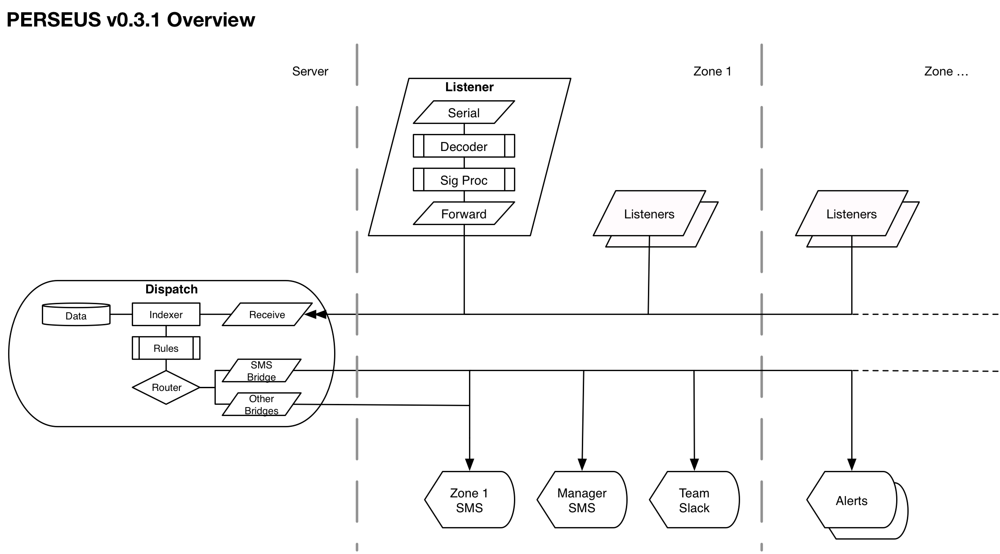

#  PERSEUS
Push Electronic Relay for Smart Alarms for End User Situational Awareness

[Derek Merck](email:derek_merck@brown.edu)  
[Leo Kobayashi](email:lkobayashi@lifespan.org)  

<https://github.com/derekmerck/PERSEUS>


## Overview

Everything old is new again.  Convert unnetworked vitals monitors into connected smart alarms.

Original test site is at [Rhode Island Hospital](http://www.rhodeislandhospital.org) Emergency Department.


### Dependencies

General:

- Python 2.7.10+
- [PyYAML](http://pyyaml.org) for configuration info
- [splunk-sdk](http://dev.splunk.com/python) (_optional for event routing_)

For Dispatch:

- [Twilio API](https://github.com/twilio/twilio-python) (_optional for alert routing_)

For Listener:

- [pyserial](https://github.com/pyserial/pyserial) for RS232 serial connection protocol
- [numpy](http://www.numpy.org) for array math functions
- [scipy](http://www.scipy.org) (_optional for quality of signal post-processing_)
- [matplotlib](http://www.matplotlib.org) (_optional for simple GUI display_)


## Setup

A PERSEUS system has three components:

1. A set of **client** systems running the PERSEUS Listener daemon or other decoder for bedside monitors.
2. A central **event store**, such as [Splunk][] or an open-source "ELK" stack ([Elastic][], [Logstash][], and Kibana).
3. A central **dispatch server** running the PERSEUS Dispatch daemon.

In testing, the event and dispatch servers are separate components running on a single central machine.

### General Setup

On Windows or Mac machines without a pre-installed git client, a binary distribution is available at [git-scm][].

[Anaconda][] is a package manager that simplifies cross-platform installation of the Python binary library dependencies required for the client systems.  `pip` can be used to install any pure-Python packages and for PERSEUS itself.


### Client Setup

Setup each client with a separate host name that will be used in the zone descriptions.

PERSEUS Listener bedside clients for Philips Intellivue monitors can be setup quickly by installing the Anaconda Python distribution as above, manually installing the numpy, scipy, and matplotlib dependencies, and using pip to install the latest PERSEUS scripts.[^pip_dependencies]

[^pip_dependences]:  Not sure why, but pip doesn't seem to install the requirements if you try to install it directly from github.

```bash
$ conda update conda
$ conda install numpy scipy matplotlib
$ pip install pyserial pyyaml splunk-sdk
$ pip install git+https://github.com/derekmerck/PERSEUS
```

If you want to clone the repository, you need to install the Python library dependencies separately as well.

```bash
$ conda update conda
$ conda install numpy scipy matplotlib
$ pip install pyserial pyyaml splunk-sdk
$ git clone https://github.com/derekmerck/PERSEUS
```

$ python -m perseus listener --values Pleth 128 ECG 256 --port /dev/cu.usbserial --splunk perseus
```

Setting the flags `--port sample --gui SimpleStripChart` will generate and display a pair of sinusoidal sample functions for testing.

See the [TelemetryStream README](TelemetryStream/README.md) for more details on the Intelivue serial protocol and setup instructions for using PERSEUS Listener with Raspberry Pi hardware.

See the [TelemetryLogs README](TelemetryLogger/README.md) for details on how to setup a client system with CWRU's stand alone decoder and a log shipper.


### PERSEUS Dispatch Setup

Install PERSEUS Dispatch and dependencies on the central server.

```bash
$ pip install pyyaml splunk-sdk twilio
$ pip install git+https://github.com/derekmerck/PERSEUS
```

Modify the example `config.yaml` file to represent the local rules, zone topology, and alert roles.

Credentials for the event store, any email relays, [Twilio][] auth tokens, and [Slack][] webhook urls can be provided as environment variables or using a `shadow.yaml` file.  Both Twilio and Slack provide free trial services.

Once the event store (Splunk, for example) is setup and the clients are running, Dispatch can be started from the command line:

```bash
$ python -m perseus dispatch --config my_config.yaml
```

Future work includes developing a fabric- or Ansible-based system to deploy and bring up the entire PERSEUS network automatically.


## Security

### Using Gmail for Email-SMS Alerts

Using gmail as an SMS relay requires either turning off app security in gmail, or assigning a unique relay password in the context of 2-step auth.


## Code Organization Overview




## Acknowledgements

- Initial development funded through a healthcare quality improvement award from the AHRQ
- The Intellivue Decoder portion of this package was forked from the RIH NeuroLogic package developed by [Agrawal](mailto:uagrawal61@gmail.com), [Oyalowo](mailto:adewole_oyalowo@brown.edu), Asaad, and others.  See <https://bitbucket.org/uagrawal61/neurologic> for documentation of the NeuroLogic project.
- The default QoS code was adapted from Xiao Hu, PhD's MATLAB code for waveform quality checks (see [TelemetryStream README](TelemetryStream/README.md) for reference).
- EmailSMSMessenger class cribbed in part from <https://github.com/CrakeNotSnowman/Python_Message>
- Splunk generously provided a _gratis_ academic license for their product
- Indebted to discussion of pip at <https://hynek.me/articles/sharing-your-labor-of-love-pypi-quick-and-dirty/>
- SimpleStripChart based on matplotlib's [strip_chart example](http://matplotlib.org/1.4.0/examples/animation/strip_chart_demo.html)


## License

[MIT](http://opensource.org/licenses/mit-license.html)

[Anaconda]: http://www.anaconda.org
[git-scm]: https://www.git-scm.com
[Splunk]: http://www.splunk.com
[Slack]: http://www.slack.com
[Twilio]: http://www.twilio.com
[Fluentd]: http://www.fluentd.org
[Logstash]: https://www.elastic.co/products/logstash
[Elastic]: https://www.elastic.co/products/elasticsearch

